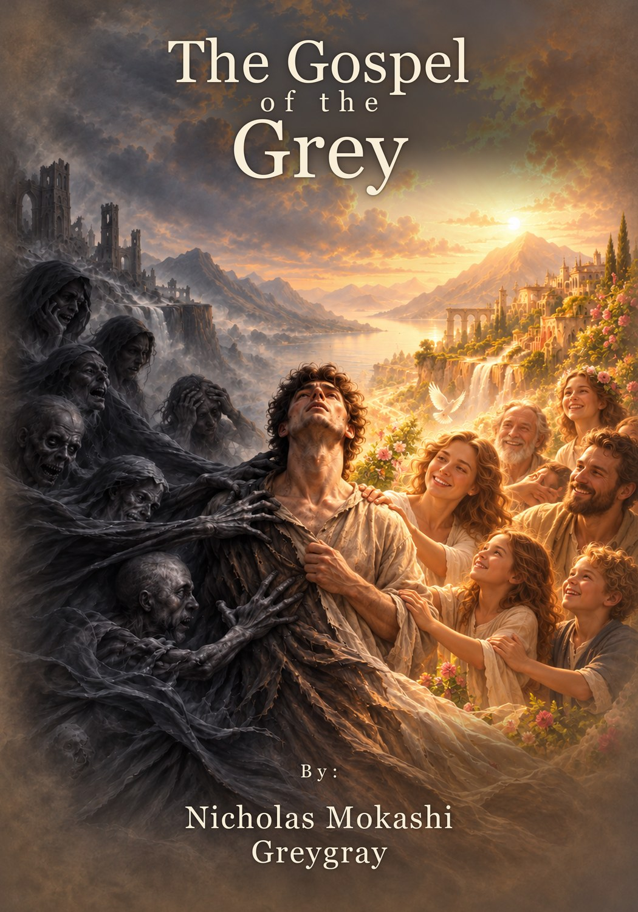

# The Gospel of the Grey

*Scripture found in a break room.*

**By Nicholas Mokashi, Greygray.**

A gospel-shaped book in progress: strange, grounded, merciful, apocalyptic when it needs to be, funny when the pressure needs release, and spiritually serious without pretending to know more than it knows. It aims to feel sacred without being fake-sacred, like scripture found in a break room, a desert, a hospital hallway, a parking lot, a grocery store, or a dream.

**The manuscript is private and nothing from it is reproduced here.** This page shows what the book is, how it is being made, and how far along it is.

---

## The shape of the book

It begins at Source and ends at Source. Between the two runs a mirrored road.

* **Seven levels of hell.** Seven distortions: divine energies bent downward through fear, hunger, separation, forgetting, false light and wounded embodiment. Each is tied to one of the seven energy centres, from the root to the crown.
* **An intermission on Earth.** Unnumbered, and not one of the fourteen levels: the middle, the balance point, the turning chamber.
* **Seven levels of heaven.** The same seven energies, healed. Every hell chapter has a mirror in a heaven chapter.
* **The return.** Back to Source, outside the ladder, carrying the body, the scars, the hunger and the memory home.

The book holds symbolic, psychological, mystical, practical and energetic meanings together without forcing one answer, and it does not claim every image or vision as literal. A scene does not have to have literally happened to be true.

## Who does what

* **Greygray** decides what is true and alive.
* **Solina** (ChatGPT) judges meaning, voice, emotional truth, spiritual coherence, and whether the work still has a soul.
* **Claude** is the file worker. It organises, blooms and branches, drafts only from an approved branch, and revises in small passes. It never writes over a draft.

## How a chapter is made

Each chapter is built the way a field note is, from pressure rather than from an outline. Nothing is drafted until the chapter has a pulse.

1. **Seed.** The raw, living spark: a symbol, a scene, a wound, a memory. It only needs to be alive.
2. **Core Glow.** The one living sentence underneath the chapter. Not a thesis, not a moral. The pulse.
3. **Wave Points.** The emotional and spiritual movements, in order, each one raising the pressure.
4. **Arrival Line.** The line or image the whole chapter leans toward.
5. **Body Anchor.** The objects, places and sensations that keep it from turning into fog. Mystery needs something to touch.
6. **Wound Pressure.** What hurts. No wound, no chapter.
7. **Revelation Pressure.** What is being unveiled, felt before it is explained.
8. **Image Feeling.** The mood of the illustrations, set before any image is made.
9. **Bloom.** All of that expanded, with its risks and its possible directions.
10. **Branch.** One direction, chosen and structured, approved before any prose exists.
11. **Draft.** Made from the approved branch, and kept unchanged as later versions are made.
12. **Enemy Edit.** A direct, hostile read that hunts fake scripture voice, self-help leakage, AI polish, decorative symbols, and pretty lines that did not earn their place. It attacks. It does not rewrite.
13. **Voice pass.** A soul check, not a polish. Does it sound like Greygray, but clearer? Where is it alive, and where is it fake?
14. **Revision.** In small, named passes, rhythm only or generic language only. Never "make it better."

Only then is a chapter approved clean, split at its image beats, and illustrated. Every plate is generated, checked against the moment it sits in, and approved one at a time. A plate takes an object or a surface from the scene rather than restaging it.

Every ruling goes into a decision log, and every symbol the book leans on is traced in a source and symbol ledger.

## Where it stands

About **58,000 words of prose are approved clean**, with **55 plates**: the opening, the threshold, all seven levels of hell, the intermission, and the first level of heaven. The rest of the heavens and the return are still to come.

A build script sets the approved chapters and plates into a full-colour 7 x 10 book, and a compressed copy goes to a Kindle Scribe for reading and marking up after every finished chapter.

---

**Built by Greygray with AI collaboration openly included in the process.**

Human judgment stays in the driver's seat.
